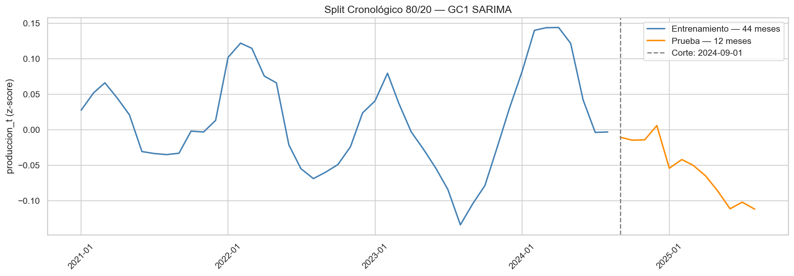
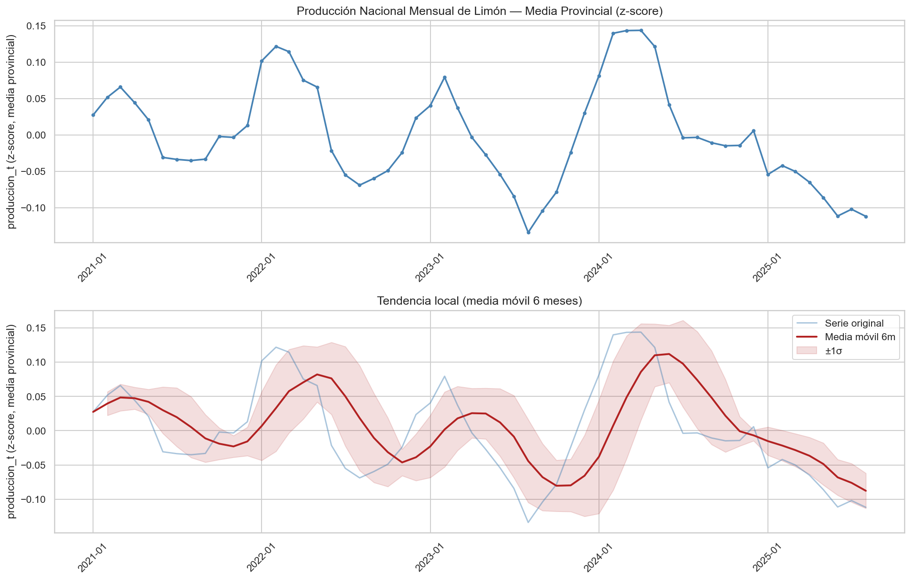
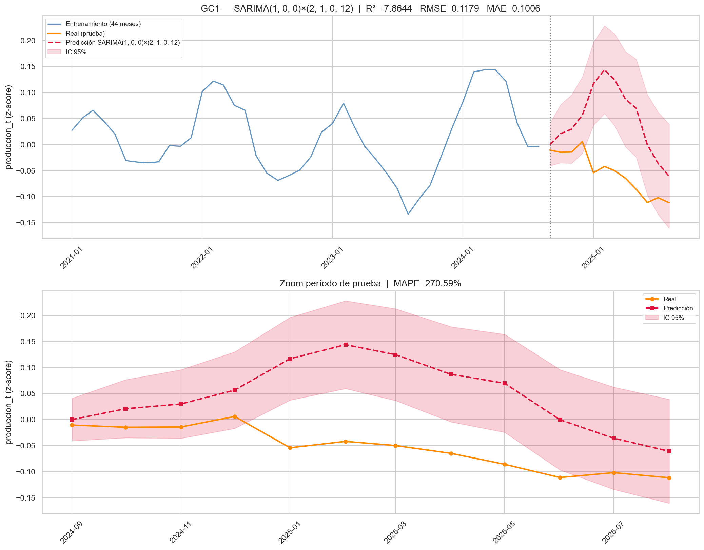
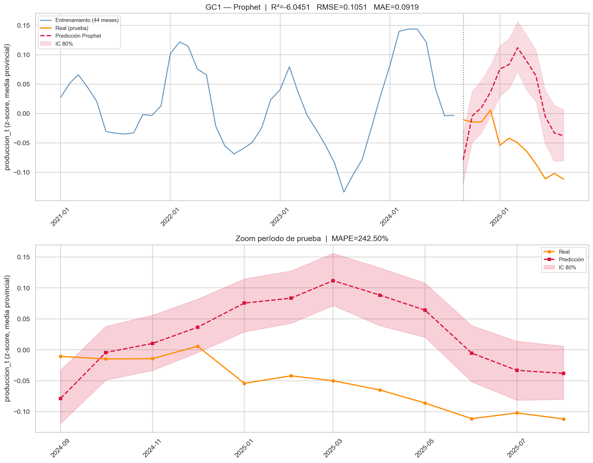
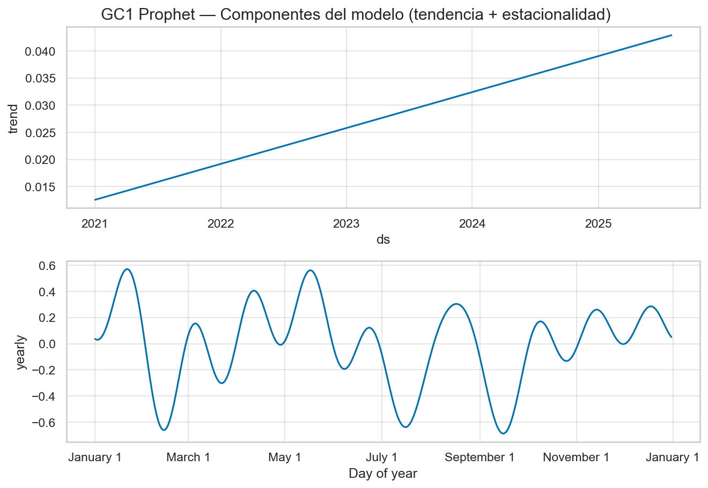

# Reporte Ejecutivo — Fase 3: Grupo de Control GC1
## SARIMA y Prophet — Predicción de Demanda de Limón Peruano

> **Universidad Peruana Unión (UPEU)** · Facultad de Ingeniería y Arquitectura
> **Autor:** Fabrizio Sánchez S. · **Fecha:** 25 de mayo de 2026
> **Proyecto:** Sistema Multimodal de Predicción Agroindustrial (Agro + Clima + NLP)

---

## 1. Contexto y Objetivo

La **Fase 3** inicia el entrenamiento de modelos predictivos sobre el dataset consolidado
de la Fase 2. El **Grupo de Control GC1** establece el *baseline* con dos modelos
estadísticos clásicos de series temporales — SARIMA y Prophet — usando únicamente
la variable objetivo `produccion_t` (serie univariada).

**Propósito del GC1:** fijar el piso de rendimiento que los modelos multivariados
(GC2, GC3, modelos multimodales con NLP/BETO) deberán superar.

---

## 2. Datos Utilizados

| Parámetro | Valor |
|---|---|
| Archivo | `data/processed/master_dataset_fase2_multivariado.csv` |
| Dimensiones | 5,880 filas x 24 columnas |
| Cobertura temporal | Enero 2021 - Agosto 2025 (56 meses) |
| Provincias | 105 · Departamentos: 23 |
| Variable objetivo | `produccion_t` (escala z-score, Fase 2) |
| **Agregacion nacional** | **Media provincial** (`.mean()`) por periodo mensual |

### Correccion aplicada

Se reemplazo `.sum()` por `.mean()` en la agregacion nacional.
**Motivo:** sumar 105 z-scores produce denominadores cercanos a 0 que inflan el MAPE
artificialmente — el MAE paso de 9.84 a 0.10, tres ordenes de magnitud de diferencia
en escala.

---

## 3. Protocolo de Validacion

| Parametro | Valor |
|---|---|
| Tipo de split | **Cronologico estricto — sin aleatorizacion** |
| Entrenamiento (80%) | 44 meses · `2021-01-01 - 2024-08-01` |
| Prueba (20%) | 12 meses · `2024-09-01 - 2025-08-01` |
| Corte | `2024-09-01` |
| Data leakage | Ninguno — modelos ajustan exclusivamente sobre `train` |



---

## 4. Serie Temporal Analizada



**Caracteristicas:**
- Serie centrada en z-score = 0, con estacionalidad anual visible
- Pico productivo en Q1 (enero-marzo), minimo en Q2-Q3
- Caida pronunciada a partir de sep-2024 (periodo de prueba)

---

## 5. Modelo SARIMA

### 5.1 Configuracion

| Parametro | Valor |
|---|---|
| Algoritmo de busqueda | `auto_arima` (pmdarima 2.1.1, stepwise, criterio AIC) |
| **Orden seleccionado** | **SARIMA(1,0,0)(2,1,0)[12]** |
| AIC (entrenamiento) | -132.62 |
| Espacio de busqueda | p, q en [0,3] · P, Q en [0,2] · d, D automatico |
| Estacionalidad | m = 12 (mensual) |
| Tipo de prediccion | Multi-step forecast (12 pasos hacia adelante) |

### 5.2 Metricas — Conjunto de Prueba (12 meses)

| Metrica | Valor |
|---|---|
| **MAE** | **0.1006** |
| **RMSE** | **0.1179** |
| MAPE | 270.59 % (no confiable con z-scores) |
| **R2** | **-7.864** |

> El MAPE es no confiable con datos en z-score (denominadores cercanos a cero).
> Las metricas de referencia son **MAE** y **RMSE**.

### 5.3 Prediccion vs Real



---

## 6. Modelo Prophet

### 6.1 Configuracion

| Parametro | Valor |
|---|---|
| Libreria | prophet 1.3.0 (Meta) |
| Modo estacionalidad | Aditivo |
| Estacionalidad anual | Activa |
| Estacionalidad semanal/diaria | Desactivada (serie mensual) |
| `changepoint_prior_scale` | 0.05 (regularizacion de tendencia) |
| `seasonality_prior_scale` | 10.0 |
| `uncertainty_samples` | 500 |

### 6.2 Metricas — Conjunto de Prueba (12 meses)

| Metrica | Valor |
|---|---|
| **MAE** | **0.0919** |
| **RMSE** | **0.1051** |
| MAPE | 242.50 % (no confiable con z-scores) |
| **R2** | **-6.045** |

### 6.3 Prediccion vs Real



### 6.4 Descomposicion: Tendencia y Estacionalidad



---

## 7. Comparativa GC1: SARIMA vs Prophet

| Metrica | SARIMA | Prophet | Mejor |
|---|---|---|---|
| **MAE** | 0.1006 | **0.0919** | Prophet |
| **RMSE** | 0.1179 | **0.1051** | Prophet |
| MAPE (%) | 270.59 | 242.50 | No aplica |
| **R2** | -7.864 | **-6.045** | Prophet |

**Prophet supera a SARIMA en las tres metricas confiables** (MAE -8.7%, RMSE -10.9%, R2 mayor).

---

## 8. Conclusiones

1. **Prophet supera marginalmente a SARIMA** en MAE, RMSE y R² sobre el conjunto de prueba.
2. **Ambos modelos tienen R² negativo**, indicando que el baseline univariado no captura
   la caida pronunciada de produccion en sep-2024 - ago-2025. Esto es esperado y justifica
   el salto a modelos multivariados con variables climaticas, desastres y NLP.
3. **El MAPE es no interpretable** para datos z-score que cruzan por cero. Se recomienda
   excluirlo de comparaciones futuras o reemplazarlo por sMAPE.
4. **GC1 fija el piso de rendimiento:** MAE aprox. 0.09-0.10 y RMSE aprox. 0.105-0.118
   en unidades z-score de media provincial.
5. La **correccion `.mean()`** es obligatoria para todos los notebooks siguientes.

---

## 9. Proximos Pasos — Fase 3

| Actividad | Modelo | Estado |
|---|---|---|
| 11 — SARIMA | GC1 baseline univariado | Completado |
| 12 — Prophet | GC1 baseline univariado | Completado |
| 13 — LSTM-Attention | GC2 univariado | Pausado |
| 14 — LSTM Multivariado | GC3 con variables exogenas | Pendiente |
| 15 — Modelo Multimodal | Agro + Clima + NLP (BETO) | Pendiente |
| 16 — Analisis SHAP | Explicabilidad XAI | Pendiente |

---

## 10. Archivos de Resultados

```
resultados/gc1/
├── reporte_ejecutivo_gc1.pdf          Este reporte (7 paginas, 657 KB)
├── reporte_ejecutivo_gc1.md           Esta version Markdown
├── gc1_sarima_model.pkl               Modelo SARIMA serializado (12.2 MB)
├── gc1_prophet_model.pkl              Modelo Prophet serializado (14 KB)
├── gc1_sarima_metricas.json           Metricas SARIMA
├── gc1_prophet_metricas.json          Metricas Prophet
├── gc1_sarima_predicciones.csv        Predicciones + IC 95% SARIMA
├── gc1_prophet_predicciones.csv       Predicciones + IC 80% Prophet
├── gc1_serie_temporal.png             Serie con media movil
├── gc1_split_cronologico.png          Corte 80/20
├── gc1_sarima_prediccion_vs_real.png  Grafico dual SARIMA
├── gc1_prophet_prediccion_vs_real.png Grafico dual Prophet
└── gc1_prophet_componentes.png        Tendencia + estacionalidad anual
```

---

*Generado automaticamente · Claude Code · Python 3.11.9 · venv del proyecto*
